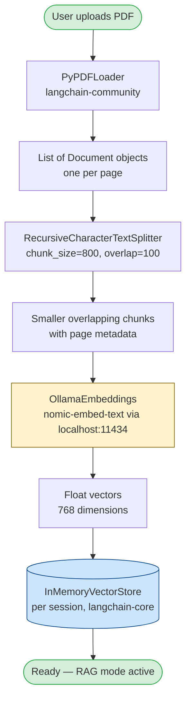
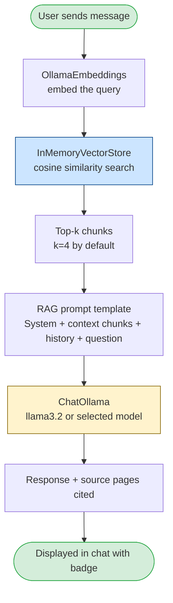
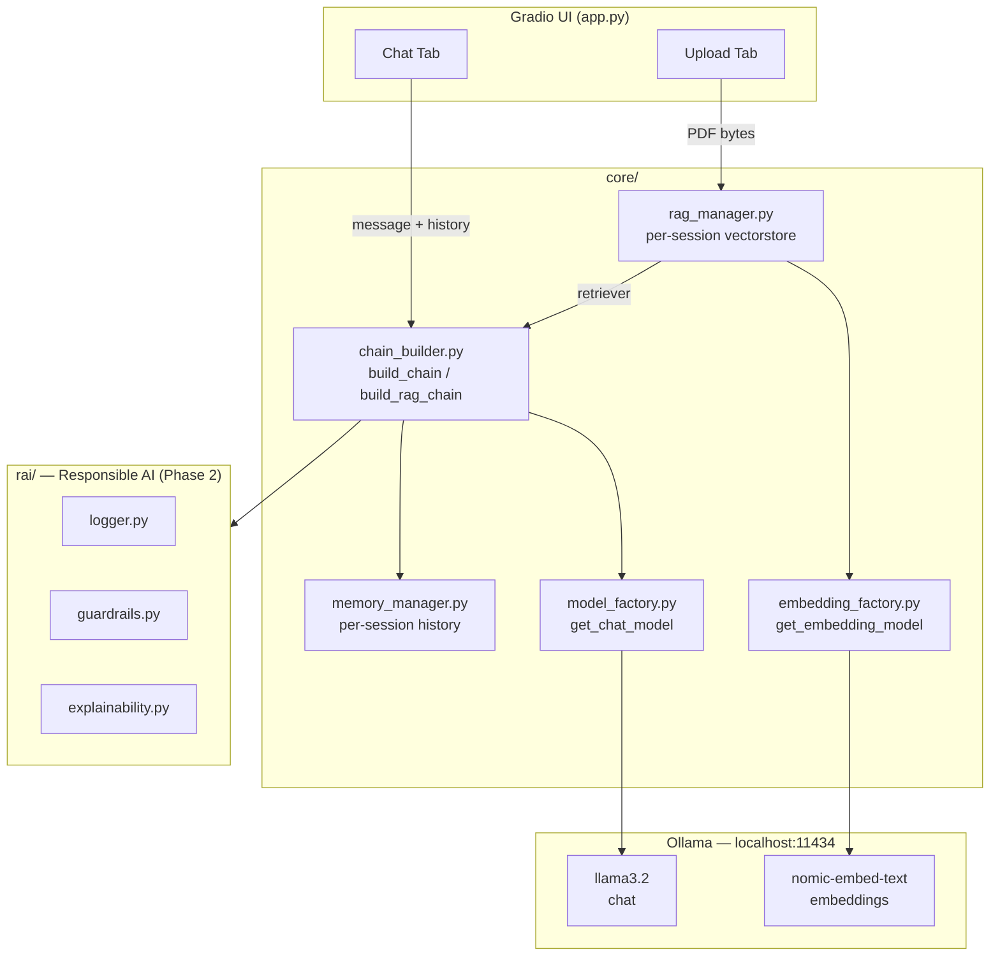

# Architecture — Chat Sandbox

## Why This Stack

### The constraint: Python 3.14

Python 3.14 was released before most ML ecosystem packages had pre-built wheels. Packages that compile Rust extensions via PyO3 (e.g. `tokenizers`, `tiktoken` source builds) hard-cap at Python ≤ 3.13. This ruled out:

- `sentence-transformers` — needs `tokenizers` (Rust/PyO3)
- `chromadb` — needs `onnxruntime` (no 3.14 wheel)
- `faiss-cpu` — C extension, no 3.14 wheel

### The solution: Ollama for everything local

Ollama exposes both LLM inference **and** embedding models over a local HTTP API. From Python's perspective, it's just an HTTP call — no C or Rust extensions, fully compatible with any Python version. This lets us run a completely local, no-GenAI-API stack on Python 3.14.

| Need | Chosen | Why |
|---|---|---|
| Chat LLM | `ChatOllama` (llama3.2) | Local, no API key |
| Embeddings | `OllamaEmbeddings` (nomic-embed-text) | Local HTTP call, no PyO3 deps |
| Vector store | `InMemoryVectorStore` (langchain-core) | Pure Python, zero deps, per-session |
| PDF loading | `PyPDFLoader` (pypdf) | Pure Python |
| Text splitting | `RecursiveCharacterTextSplitter` | Pure Python |

---

## RAG Pipeline

### Indexing (on PDF upload)



### Query / Retrieval (on each message)



---

## Full System Overview



---

## Chunking Strategy

| Parameter | Value | Rationale |
|---|---|---|
| `chunk_size` | 800 tokens | Fits comfortably in llama3.2's context with 4 chunks + history |
| `chunk_overlap` | 100 tokens | Prevents cutting sentences mid-thought at boundaries |
| `separators` | `["\n\n", "\n", ". ", " "]` | Respects paragraph → sentence → word hierarchy |
| Top-k retrieval | 4 chunks | Balances context richness vs prompt length |

## Embedding Model

**nomic-embed-text** (274 MB) produces 768-dimension vectors. Chosen over `all-minilm` (the common sentence-transformers default) because:
- Ships with Ollama — zero additional installation
- 768 dims vs 384 dims — better recall on longer documents
- Apache 2.0 license — no usage restrictions

## Upgrade Path

When Python 3.14 wheels land for PyO3-based packages (expected ~late 2025):

```
OllamaEmbeddings  →  sentence-transformers/all-MiniLM-L6-v2  (offline, no Ollama dep)
InMemoryVectorStore  →  ChromaDB  (persistent across sessions)
```

Both are single-line swaps in `core/embedding_factory.py` and `core/rag_manager.py`.
